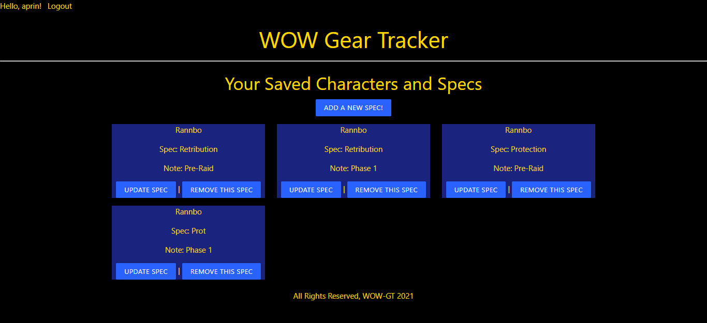
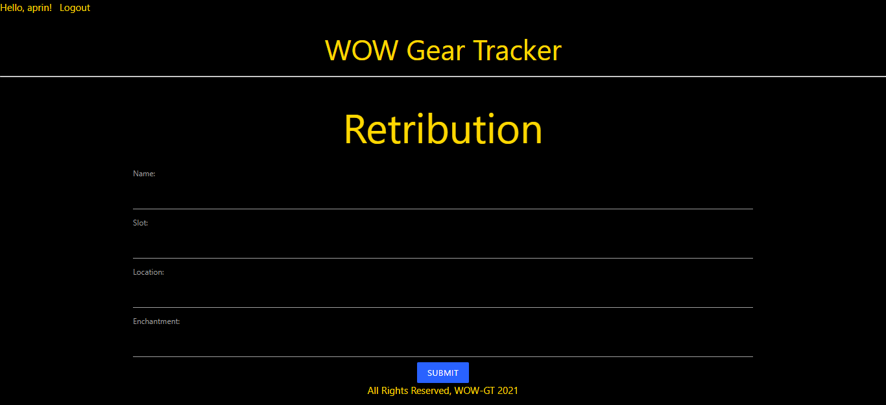

  <h1 align="center">WOW Gear Tracker</h1>

<details open="open">
  <summary>Table of Contents</summary>
  <ol>
    <li>
      <a href="#about-the-project">About The Project</a>
      <ul>
        <li><a href="#built-with">Built With</a></li>
      </ul>
    </li>
    <li>
      <a href="#getting-started">Getting Started</a>
    </li>
    <li><a href="#usage">Usage</a></li>
    <li><a href="#contact">Contact</a></li>
    <li><a href="#future-considerations">Future Considerations</a></li>
  </ol>
</details>

<!-- ABOUT THE PROJECT -->

## About The Project



This project was designed as a simple one stop shop to save and view characters on World of Warcraft Classic, and allow you to save the items you want to collect for that character to view easily at a glance in the future.

### Built With

- [Materialize](https://materializecss.com/)
- [Django](https://www.djangoproject.com/)
- [SQL DB](https://www.mysql.com/)
- [Python](https://www.python.org/)

## Getting Started

1. _`Fork`_ and _`Clone`_ this respository to your local machine
2. Run pip install -r requirements.txt to install project dependencies
3. Run your python server and check it out!

## Usage

Use the app to save your desired gear to a specific character and spec to allow you to view it later



## Code snippets

### One to many association of gear to a single user created spec

```
def assoc_spec_gear(request):
    split_form_data = request.body.decode('utf-8').split('&')
    x = parse_data(split_form_data)
    print(request.user.id)

    print('( NEW X )', x)
    g = Gear(
        name=x.get('name'),
        slot=x.get('slot'),
        location=x.get('location'),
        enchant=x.get('enchant'),
        user_id=request.user.id,
        spec_id=int(x.get('spec_id'))
    )
    g.save()

    print('( NEW Gear )', g)

    print('( proof )', Gear.objects.get(id=g.id))

    return HttpResponseRedirect('/specs')
```

### Template for gear creation and association

```
<div class="container">
  <h1>{{ spec.name }}</h1>
  <form autocomplete="off" action="" method="post">
    
    <label for="name">Name:</label>
    <input name="name" type="text" />
    <label for="slot">Slot:</label>
    <input name="slot" type="text" />
    <label for="location">Location:</label>
    <input name="location" type="text" />
    <label for="enchant">Enchantment:</label>
    <input name="enchant" type="text" />
    <input name="spec_id" type="hidden" value="{{ spec.id }}" />
    <div class="center-align">
      <input
        class="waves-effect blue accent-4 btn-small"
        type="submit"
        value="Submit"
      />
    </div>
  </form>
</div>
```

### Models for gear and specs

```
class Spec(models.Model):
    character = models.CharField(max_length=100)
    name = models.CharField(max_length=100)
    description = models.CharField(max_length=100)
    user = models.ForeignKey(User, on_delete=models.CASCADE)

    def __str__(self):
        return self.name


class Gear(models.Model):
    name = models.CharField(max_length=100)
    slot = models.CharField(max_length=100)
    location = models.CharField(max_length=100)
    enchant = models.CharField(max_length=100)
    user = models.ForeignKey(User, on_delete=models.CASCADE)
    spec = models.ForeignKey(Spec, on_delete=models.CASCADE)

    def __str__(self):
        return self.name
```

## Contact

Aaron Prince - aprin418@gmail.com

Project Link: [https://github.com/aprin418/WOW-GT](https://github.com/aprin418/WOW-GT)

## Acknowledgements

- [Materialize](https://materializecss.com/)
- [Django](https://www.djangoproject.com/)
- [SQL DB](https://www.mysql.com/)
- [GitHub](https://github.com/)
- [Python](https://www.python.org/)

## Future Considerations

- Would like to add a search feature incorperating the blizzard API that will allow you to save images, stats and more details for each piece of gear
- Would like to add a layout to the spec page that will show each gear slot for the character and allow you to save pieces associated with that slot to allow a better visual experience when referencing any saved gear
- Would like to improve styling to add images specific to each spec
- Would like to add images to gear

### Code snippet of initial phases of search route

```
@login_required
def search(request):
    response = requests.get(
        'https://us.api.blizzard.com/data/wow/search/item?namespace=static-us&name.en_US=power&orderby=id&_page=1&access_token=API-KEY')
    data = response.json()
    resultData = []
    for item in data['results']:
        print(item['data']['inventory_type']['name']['en_US'])
        gearDict = {
            'type': item['data']['inventory_type']['name']['en_US'],
            'name': item['data']['name']['en_US'],
        }
        resultData.append(gearDict)
        context = {'gearDict': resultData}
    print(resultData)
    print(context)
    return render(request, 'results.html', {'context': resultData})
```
